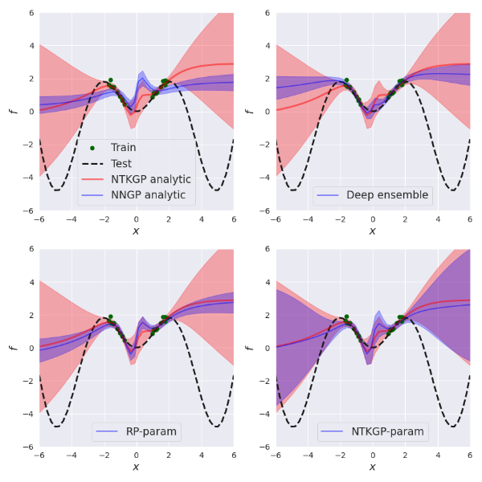

# Bayesian Deep Ensembles via the Neural Tangent Kernel
Repository, `bayesian-ntk`, to accompany the paper [Bayesian Deep Ensembles via the Neural Tangent Kernel](https://arxiv.org/abs/2007.05864).

<p align="center">
  
</p>            

## Requirements

To install requirements:
```setup
pip install -r requirements.txt
```

## Colab Notebook
The functionality of `bayesian-ntk` is explained in our notebook `toy_1d_example.ipynb`, which you can [](https://colab.research.google.com/github/bobby-he/bayesian-ntk/blob/master/toy_1d_example.ipynb) here.
